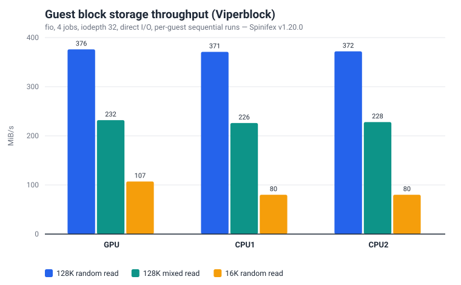
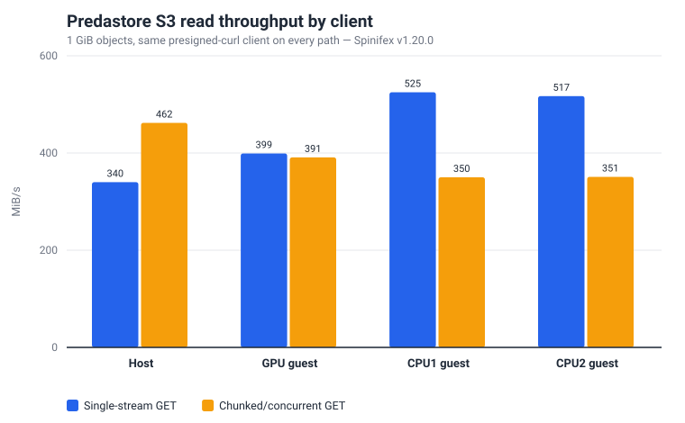
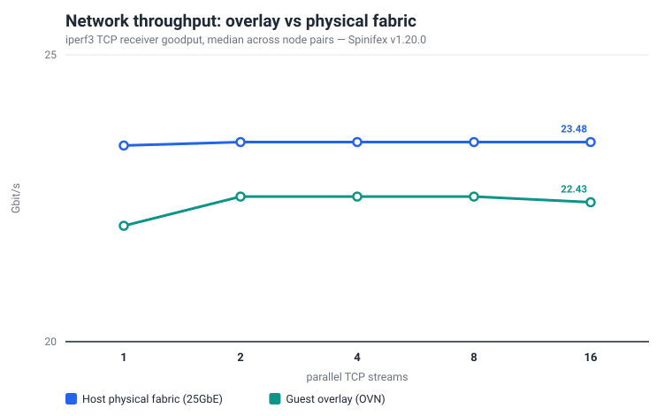

## Overview

This reference architecture turns three Cisco Unified Edge servers into a small,
resilient cloud that can run where data is produced: a factory, retail estate,
branch, lab, sovereign environment, or disconnected site. Spinifex exposes EC2,
EBS, S3 and EKS-compatible APIs on the cluster, so the operational model is
familiar: use the AWS CLI, SDKs, Terraform or OpenTofu, Kubernetes manifests and
CI/CD systems already used for AWS. The change is the endpoint, not the workflow.

**Companion architectures:** [Vision Pipeline on Cisco UCS](/hardware/cisco/vision-pipeline) shows a local AI pipeline that streams inputs from S3; [vLLM Serving on Cisco UCS](/hardware/cisco/llm-serving) shows CPU and GPU model serving on the same cluster.

### Platform

| Component | Specification |
|---|---|
| **Chassis** | 3× Cisco Unified Edge, single-socket each |
| **CPU** | 1× Intel Xeon 6543P-B per node — 32 cores / 64 threads, 800 MHz–3.30 GHz |
| **Cache / NUMA** | L3 128 MB (unified), single NUMA node — no vCPU/memory locality tuning needed |
| **ISA** | AVX-512 (F/DQ/BW/VL/VNNI/BF16/FP16), **Intel AMX** (tile/BF16/INT8), VT-x, VT-d |
| **Memory** | 499 GiB usable per node (≈1.5 TiB aggregate) |
| **GPU** | 1× NVIDIA L4 (23,034 MiB) via VFIO PCIe passthrough on one node; the other two nodes are CPU-only |
| **Storage** | 4× KIOXIA CD8P NVMe (1.92 TB each) per node, raw — Predastore and Viperblock claim these directly |
| **Boot** | Cisco SATA RAID VD (Marvell 88SE9230 controller) |
| **Network** | 2× Intel E825-C 25GbE ports per node — one bond for management/WAN (VLAN 1337), one dedicated to storage/cluster traffic (VLAN 1336, full 25GbE) |
| **Aggregate** | 96 cores / 192 threads, ~1.5 TiB RAM, ~23 TiB raw NVMe, 1× L4 GPU |

Single-NUMA-per-node simplifies placement — no vCPU/memory locality tuning required.
GPU workloads schedule to the L4 node; CPU instances can use all three. Storage and
object data are distributed across the cluster rather than tied to the node that
launched an instance.

### Hardware Chassis


## Architecture

### AWS services exercised

| Service | Role |
|---|---|
| **EC2** | Guest instances across all three nodes; spread placement groups distribute across physical nodes |
| **EBS (Viperblock)** | Root and data volumes per instance, surviving termination independently when `delete_on_termination = false` |
| **S3 (Predastore)** | Cluster-wide object storage for datasets, model weights, artifacts and backups |
| **VPC (OVN)** | Overlay networking between instances |
| **EKS** | (Optional) Kubernetes control plane with pod rescheduling on node failure |

## Prerequisites

- 3-node Spinifex cluster installed and services healthy on all nodes — follow the [Multi-Node Install](/docs/install-multi-node) guide.
- VPC, subnet, network address pool, SSH key pair, and security group configured — see [VPC Networking](/docs/vpc-networking) and [Launching Instances](/docs/launching-instances).
- GPU passthrough enabled on the L4 node when GPU instances are required — see [GPU Passthrough](/docs/gpu-passthrough):

```bash
sudo spx admin gpu setup   # reboot required after this step
sudo spx admin gpu enable
```

- AWS CLI configured with `AWS_PROFILE=spinifex` pointing at the cluster's EC2-compatible endpoint (`https://<host>:9999`).

## Instructions

### 1. Verify the cluster and its control plane

Before placing workloads, confirm all three nodes are ready and that the storage and
control-plane services are running on each:

```bash
spx get nodes
systemctl is-active spinifex-predastore spinifex-viperblock spinifex-daemon
```

Predastore's Raft group and OVN's northbound/southbound databases are both distributed
across all three nodes — losing one node triggers a clean leader re-election among the
remaining two, and object storage and networking continue serving. Check that all three
nodes are contributing to the Raft group before exposing the cluster to workload traffic.

### 2. Launch instances through the EC2-compatible API

Point an existing AWS profile at the Spinifex endpoint and use the standard EC2
instance lifecycle. Terraform is the recommended path — Spinifex's spread placement
group implementation holds node reservations that are not always released on destroy,
so a fixed group name can cause a subsequent apply to hang. Using a per-deploy unique
name (via `random_id` or equivalent) avoids this:

```hcl
resource "random_id" "suffix" {
  byte_length = 4
}

resource "aws_placement_group" "spread" {
  name     = "edge-spread-${random_id.suffix.hex}"
  strategy = "spread"
}

resource "aws_instance" "worker" {
  count                  = 2
  ami                    = var.ami_id
  instance_type          = "m8i.2xlarge"
  subnet_id              = var.subnet_id
  key_name               = var.key_name
  placement_group        = aws_placement_group.spread.name
  vpc_security_group_ids = [var.security_group_id]
}
```

For a one-off launch via the CLI, use a unique group name each time for the same reason:

```bash
export AWS_PROFILE=spinifex
GROUP="edge-spread-$(openssl rand -hex 4)"

aws ec2 create-placement-group \
  --group-name "$GROUP" \
  --strategy spread

aws ec2 run-instances \
  --image-id "$AMI" --instance-type m8i.2xlarge \
  --count 2 \
  --subnet-id "$SUBNET" --security-group-ids "$SECURITY_GROUP" \
  --key-name "$KEY_NAME" \
  --placement "{\"GroupName\":\"$GROUP\"}"
```

A `g6.2xlarge` instance type routes to the node with GPU passthrough configured;
`m8i` types schedule across all three nodes.

### 3. Attach Viperblock volumes and access Predastore object storage

Create and attach an EBS-compatible data volume to a running instance:

```bash
VOLUME_ID=$(aws ec2 create-volume \
  --availability-zone "$AZ" \
  --size 100 --volume-type gp2 \
  --query VolumeId --output text)

aws ec2 attach-volume \
  --volume-id "$VOLUME_ID" \
  --instance-id "$INSTANCE_ID" \
  --device /dev/sdf
```

Setting `delete_on_termination = false` in Terraform keeps the volume alive across
instance replacement — relaunching a terminated instance re-attaches the same volume
rather than starting from empty storage:

```hcl
resource "aws_ebs_volume" "data" {
  availability_zone = var.az
  size              = 100
  type              = "gp2"
}

resource "aws_volume_attachment" "data" {
  device_name           = "/dev/sdf"
  volume_id             = aws_ebs_volume.data.id
  instance_id           = aws_instance.worker[0].id
  delete_on_termination = false
}
```

Predastore presents an S3-compatible endpoint — standard S3 tooling works without
modification:

```bash
aws s3 mb s3://my-bucket
aws s3 cp ./dataset.tar.gz s3://my-bucket/
aws s3 sync ./results/ s3://my-bucket/results/
```

All three nodes share the same bucket over the cluster's internal storage fabric, so
datasets, model weights and pipeline outputs are accessible to any instance without
mounting a shared filesystem.

### 4. Optional: deploy Kubernetes workloads through the EKS-compatible API

Spinifex also exposes an EKS-compatible control plane — this was not part of the Cisco
exercise documented here, which used EC2, EBS and S3 directly. For workloads where
automatic pod rescheduling matters, Spinifex supports the same `kubectl` workflows as
a standard EKS cluster:

```bash
kubectl get nodes
kubectl apply -f deployment.yaml
kubectl get pods -n default
```

Kubernetes pod rescheduling is the platform's primary answer to node failure for
scheduled workloads. The companion [vision pipeline](/hardware/cisco/vision-pipeline)
and [vLLM serving](/hardware/cisco/llm-serving) architectures use raw EC2 instances;
EKS is the pattern to reach for when automatic rescheduling matters over manual placement.

### 5. Storage benchmark

Predastore and Viperblock — Spinifex's S3 and EBS implementations — represent the
most substantial engineering work in the platform. Implementing reliable erasure-coded
object storage and a distributed block device stack on commodity NVMe, while exposing
the AWS API surface that most workloads depend on, is where most of the hard problems
live. Both subsystems are under active development, and a production-grade environment
like this cluster is where integration-level issues surface before they reach users. Run this check after cluster setup or hardware
changes to confirm both services are performing as expected.

The methodology: one guest per physical node, fio against an ext4 Viperblock data
volume (four jobs, iodepth 32, direct I/O, 512 MiB file, 30-second run), three
sequential repetitions per guest.

| Guest | 16K mixed read/write | 16K random read | 128K mixed read/write | 128K random read |
|---|---:|---:|---:|---:|
| GPU | 107 / 46 MiB/s | 107 MiB/s | 232 / 101 MiB/s | 376 MiB/s |
| CPU1 | 80 / 35 MiB/s | 80 MiB/s | 226 / 98 MiB/s | 371 MiB/s |
| CPU2 | 79 / 34 MiB/s | 80 MiB/s | 228 / 98 MiB/s | 372 MiB/s |



The 128K guest random-read numbers (371–376 MiB/s) sit between the [AWS EBS gp3](https://docs.aws.amazon.com/ebs/latest/userguide/general-purpose.html)
baseline (125 MiB/s) and its provisioned maximum (1,000 MiB/s). The 16K numbers (79–107 MiB/s) land near that baseline.

128K mixed I/O improves throughput but carries a high p99 latency envelope (roughly
0.45–0.80 s); size queues and write patterns accordingly for latency-sensitive
applications.

Predastore S3 validation used 1 GiB objects. The AWS CLI splits any download above 8 MiB into concurrent ranged GETs while a plain client issues a single streaming GET, so the sweep measures both patterns with the same client (presigned `curl`) on the host and on each guest — a single-stream PUT/GET, and a chunked/concurrent Range GET (8 MiB parts, 10 in flight) that mirrors the AWS CLI's default download path — with three repetitions each:

| Client | Single-stream read | Chunked/concurrent read |
|---|---:|---:|
| Host | 340 MiB/s | 462 MiB/s |
| GPU guest | 399 MiB/s | 391 MiB/s |
| CPU1 guest | 525 MiB/s | 350 MiB/s |
| CPU2 guest | 517 MiB/s | 351 MiB/s |



Single-stream writes land at 282–304 MiB/s across the host and all three guests. Under three simultaneous clients — one per physical node — the cluster sustains 640 MiB/s aggregate read and 538 MiB/s aggregate write from the host, and 665 / 515 MiB/s from the guests.

With the client held constant, single-stream host and guest reads fall in the same 340–525 MiB/s band, and aggregate read reaches 640–665 MiB/s across three concurrent clients. The chunked/concurrent Range-GET results vary by individual client rather than tracking host-versus-guest; that variation has no confirmed explanation yet and remains under investigation. All sequential S3 checksum validations passed.

### 6. Network benchmark

Network throughput was measured with iperf3 over TCP, with a 10-second run after a 3-second warmup, five repetitions at 1, 2, 4, 8 and 16 parallel streams, on two paths: host-to-host across the dedicated 25GbE storage fabric (VLAN 1336), and guest-to-guest across the OVN overlay that connects instances.

| Path | Single stream | 2–16 streams |
|---|---:|---:|
| Host physical fabric (25GbE) | 23.4 Gbit/s | 23.5 Gbit/s |
| Guest overlay (OVN) | 22.0 Gbit/s | 22.5 Gbit/s |



TCP goodput on a 25GbE link settles near 23.5 Gbit/s once framing and protocol overhead are removed, so the host path runs at effectively line rate with zero retransmissions. The guest overlay sustains 22.0 Gbit/s on a single stream, rising to 22.5 Gbit/s at two streams and holding flat through sixteen — 95–96% of the physical fabric across the full range.

## What this architecture unlocks

- **Cloud-to-edge placement:** run the same EC2, volume, S3 and Kubernetes patterns at the site where latency, privacy, bandwidth or sovereignty requires it.
- **Familiar operations:** keep AWS CLI profiles, Terraform/OpenTofu modules, SDKs, CI/CD pipelines and deployment tooling rather than introducing a separate edge-only platform.
- **Local AI with shared data:** place GPU and AMX-capable CPU inference next to the data source while keeping datasets and artifacts available to all instances through S3.
- **A resilient foundation:** distribute control and storage services across three physical Cisco nodes instead of concentrating the site on one server. Kubernetes rescheduling and Raft-based storage both tolerate a single node loss without operator intervention.
- **A path back to cloud:** the same APIs at the edge and on AWS make workload movement, burst strategies and consistent application packaging straightforward.

The raw measurements are evidence that the platform is functioning as designed; the
larger outcome is a portable, resilient operating model for workloads that need cloud
interfaces outside a public-cloud region.
